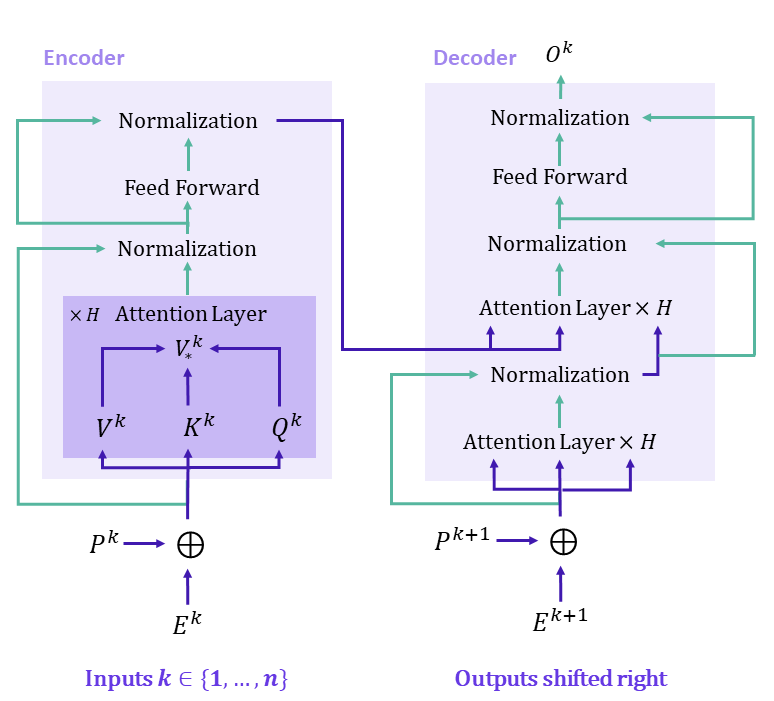

# Geometric Data Analysis - Graph Transformers

This repository was forked from the [original source code](https://github.com/graphdeeplearning/graphtransformer) for the paper "**[A Generalization of Transformer Networks to Graphs](https://arxiv.org/abs/2012.09699)**" by _[Vijay Prakash Dwivedi](https://github.com/vijaydwivedi75) and [Xavier Bresson](https://github.com/xbresson)_, at **AAAI'21 Workshop on Deep Learning on Graphs: Methods and Applications (DLG-AAAI'21)**. 

In this repository, we re-use and adapt the original code to run on an extended number of datasets as well as perform some experiments on graph laplacian eigenvectors and graph kernel methods for node classification. This project aims to provide a critical perspective highlighting the strengths and limitations of the original paper as well as running some additional experiments to get hands-on experience with the code. To get a better look at the work that was carried out, check the final project report in docs/Final_project_report_BouHanna_Partarrieu.pdf.

 

  
   
  <b>Figure</b>: Block Diagram of Original Transformer architecture

## 1. Repo installation

The initial project is based on the [benchmarking-gnns](https://github.com/graphdeeplearning/benchmarking-gnns) repository.

[Follow these instructions](./docs/01_benchmark_installation.md) to install the benchmark and setup the environment.

 

## 2. Download datasets

[Proceed as follows](./docs/02_download_datasets.md) to download the datasets used to evaluate Graph Transformer.

 

## 3. Experiments & Running on new data
A few main scripts were added to be able to run on new data:
- main_Pubmed_node_classification.py: this contains the actual training loop and parses the config (json) file to get the architecture parameters when training the model
- data/Pubmed.py: this has both classes load_Pubmed and PubmedDataset which are essential to be able to load the datasets from the pytorch geometric library and then create the custom class that is needed by the Graph Transformer architecture (need to able to add the laplacian positional encodings, work with dgl library etc etc)
- train/train_Pubmed_node_classification.py: this file contains the training and evaluation functions and only features small changes compared to the original training scripts

Overall, to be able to run graph transformers on new datasets, these are the files that one has to create.

The main experiments were conducted in notebooks after creating the above files. These can be found in:
- node_classif_benchmark.ipynb: simply downloading the correct libraries and calling main_Pubmed_node_classification.py
- simpler_baselines.ipynb: running graph kernels & spectral clustering for node classification as simple comparative baselines

 

## 4. Reference 

:page_with_curl: Paper [on arXiv](https://arxiv.org/abs/2012.09699)    
:pencil: Blog [on Towards Data Science](https://towardsdatascience.com/

   

